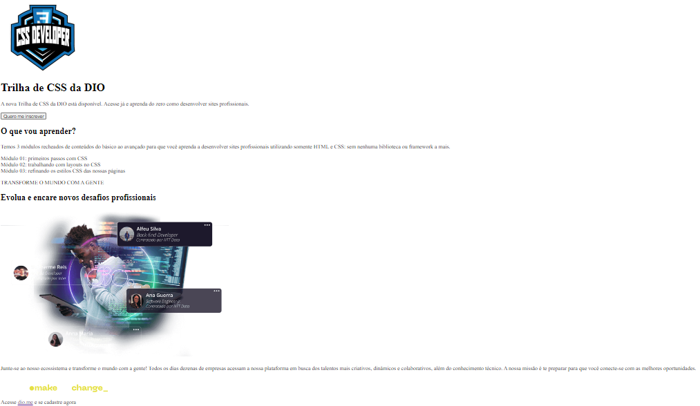

# Landing page com CSS

&emsp;Me foi posto o desafio de criar a estilização de uma landing page de acordo com o [Protótipo do Figma](https://www.figma.com/file/3PiokoJj9IhGDnNiWAJbz7/DIO---Desafio-01?node-id=0%3A1) designado, para testar minhas competências com CSS.

&emsp;De início, foi montado o [HTML do documento](./index.html) para que se trabalhe em cima dele. Sendo esta a estrutura dele sem estilo nenhum:

&emsp;Agora, após análise do protótipo do Figma e mão na massa, este foi o resultado final da minha landing page: